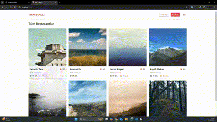

# Food Delivery App (Yemek Sepeti Clone)

This project is a clone of a food delivery app, inspired by "Yemek Sepeti," developed using **React**, **Redux**, **Redux Thunk**, and **JSON Server**. The application provides functionality for displaying a list of products, adding/removing items from the cart, and routing with React Router Dom.



## Features

- **Product List:** Displays product items fetched from a mock JSON server.
- **Add/Remove from Cart:** Users can add or remove products from their cart.
- **Dynamic Cart Update:** The cart dynamically updates using Redux as products are added or removed.
- **Routing:** Navigation between different sections using React Router Dom.
- **Styling:** Responsive design using Tailwind CSS for a clean user experience.
- **Icons:** Includes interactive icons using React Icons.

## Tech Stack

- **React.js**: For building the user interface and managing component states.
- **React Router Dom**: For client-side routing.
- **Redux, React Redux & Redux Thunk**: For managing and updating the global state with asynchronous support.
- **JSON Server**: Simulates a backend to serve product data.
- **Axios**: For handling HTTP requests to the JSON Server.
- **Tailwind CSS**: For responsive and modern styling.
- **React Icons**: Provides icons to enhance UI interactions.

## Installation

1. Clone the repository:

   ```bash
   git clone https://github.com/yourusername/food-delivery-app.git
   ```

2. Install dependencies:

   ```bash
   cd food-delivery-app
   npm install
   ```

3. Start JSON Server:

   ```bash
   npx json-server --watch db.json --port 3000
   ```

4. Start the React app:

   ```bash
   npm start
   ```

## Usage

1. Navigate through different sections using the app's navigation.
2. Browse products and add items to your shopping cart.
3. View and manage items in your cart with real-time updates.
